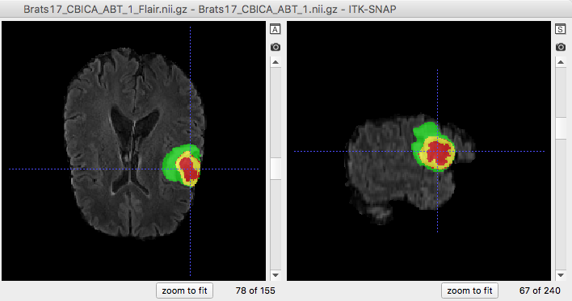

# Overview
This repository provides source code and pre-trained models for brain tumor segmentation with BraTS dataset. The method is detailed in [1], and it won the 2nd place of MICCAI 2017 BraTS Challenge. In addition, it is adapted to deal with BraTS 2015 dataset.

This implementation is based on NiftyNet and Tensorflow. While NiftyNet provides more automatic pipelines for dataloading, training, testing and evaluation, this naive implementation only makes use of NiftyNet for network definition, so that it is lightweight and extensible. A demo that makes more use of NiftyNet for brain tumor segmentation is proivde at
https://cmiclab.cs.ucl.ac.uk/CMIC/NiftyNet/tree/dev/demos/BRATS17

If you use any resources in this repository, please cite the following papers:

* [1] Guotai Wang, Wenqi Li, Sebastien Ourselin, Tom Vercauteren. "Automatic Brain Tumor Segmentation using Cascaded Anisotropic Convolutional Neural Networks." In Brainlesion: Glioma, Multiple Sclerosis, Stroke and Traumatic Brain Injuries. Pages 179-190. Springer, 2018. https://arxiv.org/abs/1709.00382
* [2] Eli Gibson*, Wenqi Li*, Carole Sudre, Lucas Fidon, Dzhoshkun I. Shakir, Guotai Wang, Zach Eaton-Rosen, Robert Gray, Tom Doel, Yipeng Hu, Tom Whyntie, Parashkev Nachev, Marc Modat, Dean C. Barratt, Sébastien Ourselin, M. Jorge Cardoso^, Tom Vercauteren^.
"NiftyNet: a deep-learning platform for medical imaging." Computer Methods and Programs in Biomedicine, 158 (2018): 113-122. https://arxiv.org/pdf/1709.03485


An example of brain tumor segmentation result.

# Requirements
* A CUDA compatable GPU with memoery not less than 6GB is recommended for training. For testing only, a CUDA compatable GPU may not be required.

* Tensorflow. Install tensorflow following instructions from https://www.tensorflow.org/install/

* NiftyNet. Install it by following instructions from http://niftynet.readthedocs.io/en/dev/installation.html or simply typing:
```bash
pip install niftynet
```

* BraTS 2015 or 2017 dataset. Data can be downloaded from http://braintumorsegmentation.org/

# How to use
## 1, Prepare data
* Download BraTS dataset, and uncompress the training and tesing zip files. For example, the training set will be in `data_root/BRATS2015_Training` or `data_root/Brats17TrainingData` and the validation set will be in `data_root/BRATS2015_Validation` or `data_root/Brats17ValidationData`.

## 2, Use pre-trained models to segment images
* To segment BraTS 2015 data, run:

```bash
python test.py config15/test_all_class.txt
```
* To segment BraTS 2017 data, run:

```bash 
python test.py config17/test_all_class.txt
```


## 3, How to train
The trainig process needs 9 steps, with axial view, sagittal view, coronal view for whole tumor, tumor core, and enhancing core, respectively.

The following commands are examples for BraTS 2017. However, you can edit the corresponding `*.txt` files for different configurations.

* Train models for whole tumor in axial, sagittal and coronal views respectively. Run: 

```bash
python train.py config17/train_wt_ax.txt
python train.py config17/train_wt_sg.txt
python train.py config17/train_wt_cr.txt
```
* Train models for tumor core in axial, sagittal and coronal views respectively. Run: 

```bash
python train.py config17/train_tc_ax.txt
python train.py config17/train_tc_sg.txt
python train.py config17/train_tc_cr.txt
```
* Train models for enhancing core in axial, sagittal and coronal views respectively. Run: 

```bash
python train.py config17/train_en_ax.txt
python train.py config17/train_en_sg.txt
python train.py config17/train_en_cr.txt
```

* To save the time for training, you may use the modals in axial view as initalizations for sagittal and coronal views. Copy variales in axial view to those in sagittal or coronal view by running:

```bash
python util/rename_variables.py
```

You may need to edit this file to set different parameters. As an example for Brats 2015, after running this command, you will see a model named `model15/msnet_tc32sg_init` that is copied from `model15/msnet_tc32_20000.ckpt`. Then just set **start_iteration=1** and **model_pre_trained=model15/msnet_tc32sg_init** in `config15/train_tc_sg.txt`. 

## 4, How to test
Similar to 'Use pre-trained models', write a configure file that is similar to `config15/test_all_class.txt` or `config17/test_all_class.txt` and 
set the value of model_file to your own model files. Run:
```bash
python test.py your_own_config_for_test.txt
```

## 5, Evaluation
Calcuate dice scores between segmentation and the ground truth, run:
```bash
python util/evaluation.py
```
You may need to edit this file to  specify folders for segmentation and ground truth. 

# Copyright
* Copyright (c) 2017-2018, University College London. All rights reserved.
